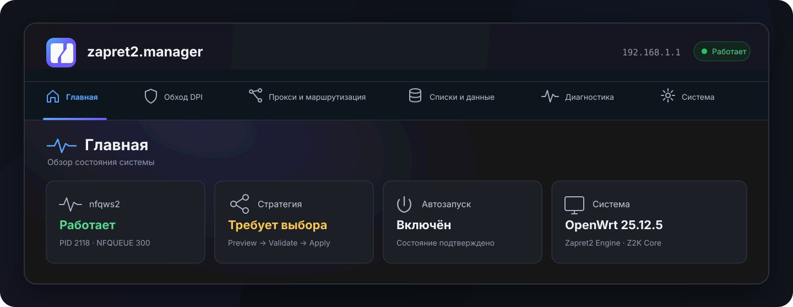
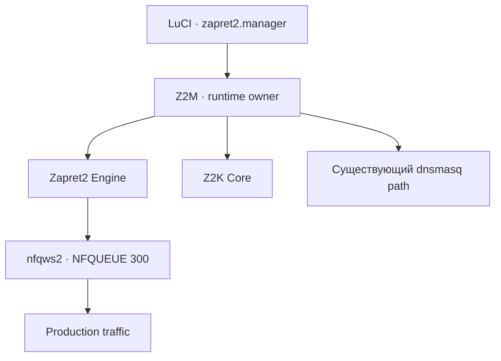

<div align="center">



<h1>zapret2.manager</h1>

<p><strong>Единый LuCI-интерфейс для управления zapret2 на OpenWrt</strong></p>

<p>
  Стратегии обхода, системные компоненты, DNS, прокси и диагностика<br>
  собраны в одном понятном и согласованном интерфейсе.
</p>

[](https://github.com/t0fox/zapret2-manager/releases/tag/main-latest)
[](https://github.com/t0fox/zapret2-manager/actions/workflows/apk-build.yml)
[](https://openwrt.org/)
[](./LICENSE)

<p>
  <a href="https://github.com/t0fox/zapret2-manager/releases/tag/main-latest"><strong>Скачать main-latest</strong></a>
  ·
  <a href="./docs/04-guides/index.md"><strong>Руководства</strong></a>
  ·
  <a href="./docs/00-home/current-state.md"><strong>Состояние проекта</strong></a>
  ·
  <a href="https://github.com/t0fox/zapret2-manager/issues"><strong>Сообщить о проблеме</strong></a>
</p>

</div>

> [!IMPORTANT]
> `main-latest` — постоянно обновляемая **предварительная сборка** из текущей ветки `main`, а не стабильный релиз. Загружай все APK из одного выпуска и перед установкой сверяй `SHA256SUMS`.

## О проекте

**zapret2.manager (Z2M)** — единый слой управления [`zapret2`](https://github.com/bol-van/zapret2) для OpenWrt. Он объединяет backend, LuCI-интерфейс и безопасные сценарии применения конфигурации, чтобы пользователю не приходилось вручную связывать движок, стратегии, списки, DNS и диагностику.

Проект строится вокруг трёх принципов:

- **одно место управления** — состояние системы и основные действия доступны из общего интерфейса;
- **понятный жизненный цикл** — изменения стратегии проходят этапы `Preview → Validate → Apply`;
- **один владелец runtime** — Z2M координирует production-конфигурацию без конкурирующих процессов и скрытых путей применения.

## Возможности

| Раздел | Что доступно |
|---|---|
| **Главная** | Сводное состояние движка, стратегии, автозапуска, системы и дополнительных компонентов |
| **Обход DPI** | Управление `nfqws2`, стратегии и Scanner с передачей найденных кандидатов в общий workflow |
| **Прокси и маршрутизация** | Отдельные сценарии для Telegram Proxy и WARP / MASQUE |
| **Списки и данные** | Сервисы и домены, ресурсы стратегий и интеграция с DNS |
| **Диагностика** | Мониторинг runtime-состояния, события и журнал |
| **Система** | Компоненты, резервные копии и общие настройки manager'а |

## Интерфейс

Навигация повторяет реальные задачи пользователя и не смешивает обязательную основу с дополнительными продуктами:

| Верхний раздел | Вложенные страницы |
|---|---|
| **Главная** | Обзор состояния системы |
| **Обход DPI** | Управление · Стратегии · Scanner |
| **Прокси и маршрутизация** | WARP / MASQUE · Telegram Proxy |
| **Списки и данные** | Сервисы и домены · Ресурсы · DNS |
| **Диагностика** | Мониторинг · Журнал |
| **Система** | Компоненты · Резервные копии · Настройки |

Интерфейс использует единую семантику статусов: зелёный означает рабочее состояние, жёлтый требует внимания, красный сообщает об ошибке, а нейтральный цвет обозначает неактивное или ещё не определённое состояние.

## Как работает применение стратегии


Scanner не создаёт второй путь изменения production-конфигурации. Его результат возвращается в общий lifecycle стратегии и применяется только после предварительного просмотра и проверки.

## Быстрый старт

### 1. Проверь совместимость

Текущий воспроизводимый контракт сборки:

| Параметр | Значение |
|---|---|
| OpenWrt | **25.12.5** |
| Target | **`mediatek/filogic`** |
| Формат пакетов | **APK** |
| Канал | **`main-latest`** |

### 2. Скачай один комплект

Открой выпуск [`main-latest`](https://github.com/t0fox/zapret2-manager/releases/tag/main-latest) и используй файлы только из него. Комплект содержит три manager-пакета, `build-manifest.json` и `SHA256SUMS`.

```text
zapret2-manager-<version>.apk
luci-app-zapret2-manager-<version>.apk
zapret2-manager-full-<version>.apk
build-manifest.json
SHA256SUMS
```

Проверь контрольные суммы перед установкой:

```sh
sha256sum -c SHA256SUMS
```

### 3. Установи пакеты

```sh
apk add --allow-untrusted \
  ./zapret2-manager-<version>.apk \
  ./luci-app-zapret2-manager-<version>.apk \
  ./zapret2-manager-full-<version>.apk
```

| Пакет | Назначение |
|---|---|
| `zapret2-manager` | Backend: ucode/shell runtime и native `z2m-core-helper` |
| `luci-app-zapret2-manager` | LuCI JavaScript frontend |
| `zapret2-manager-full` | Target-specific meta-package для полного набора Z2M |

> [!NOTE]
> **Zapret2 Engine** устанавливается отдельно через **Система → Компоненты**. Telegram Proxy также является отдельным дополнительным компонентом и устанавливается через **Прокси и маршрутизация → Telegram Proxy**.

### 4. Выполни первоначальную проверку

Открой LuCI, перейди в **zapret2.manager** и последовательно проверь:

```text
Система → Компоненты
        ↓
Zapret2 Engine + Z2K Core
        ↓
Обход DPI → Стратегии
        ↓
Preview → Validate → Apply
```

## Компоненты и границы ответственности

| Компонент | Роль | Обязательный |
|---|---|:--:|
| **zapret2.manager** | Production runtime owner и координатор | Да |
| **Zapret2 Engine** | Базовый anti-DPI engine | Да |
| **Z2K Core** | Интеграционная и runtime-основа manager'а | Да |
| **Avatar Catalog** | Источник стратегий и ресурсов, donor reference | Нет |
| **Telegram Proxy** | Отдельный proxy product со своим lifecycle | Нет |
| **WARP / MASQUE** | Дополнительный proxy/routing product | Нет |

> [!WARNING]
> Avatar Catalog не является системным компонентом и не становится вторым runtime writer'ом. Low-level assets Z2K также не образуют отдельный пользовательский продукт.

<details>
<summary><strong>Архитектура runtime</strong></summary>

<br>



В production работает один постоянный `nfqws2` на **NFQUEUE 300**. DNS следует существующему пути владения `dnsmasq`; Z2M не запускает второй resident DNS daemon.

</details>

## Документация

| Раздел | Назначение |
|---|---|
| [Руководства](./docs/04-guides/index.md) | Установка, первый запуск и пользовательские сценарии |
| [Текущее состояние](./docs/00-home/current-state.md) | Актуальная evidence-backed модель проекта и границы готовности |
| [Архитектура](./docs/02-architecture/) | Компоненты, ownership и потоки данных |
| [Контракты](./docs/04-contracts/) | Backend/API и формальные runtime-контракты |
| [Исследования](./docs/10-research/) | Проверки подходов и технические исследования |
| [Operations](./docs/11-operations/) | Эксплуатационные процедуры и evidence |

<details>
<summary><strong>Разработка и сборка</strong></summary>

<br>

### Сборка APK

Канонический release entrypoint:

```sh
scripts/release/build-apk.sh
node scripts/release/verify-artifacts.mjs dist
```

Точечная сборка пакетов через OpenWrt SDK:

```sh
make package/zapret2-manager/compile V=s
make package/luci-app-zapret2-manager/compile V=s
make package/zapret2-manager-full/compile V=s
```

### Native foundation

`zapret2-manager/src/z2m-core-helper/` содержит native filesystem/helper foundation и protocol manifest.

Основные контракты:

- [`native-backend-v1.md`](./docs/04-contracts/native-backend-v1.md)
- [`z2m-canonical-json-v1.md`](./docs/04-contracts/z2m-canonical-json-v1.md)

### Тесты

```sh
scripts/test/native.sh
```

Для запуска нужны Node.js, C compiler, `pkg-config`, json-c development files, ucode и passwordless `sudo` для root-policy helper test.

Если ucode установлен не в `/opt/ucode`:

```sh
export UCODE_BIN=/path/to/ucode
export UCODE_LIBRARY_PATH=/path/to/ucode/libs
```

Host/source tests не заменяют реальную сборку OpenWrt SDK, проверку на роутере и browser/runtime evidence.

### Проверка документации

```sh
node scripts/docs.mjs verify
node scripts/docs.mjs build public
node scripts/docs.mjs build internal
node scripts/validate-knowledge.mjs
```

</details>

## Связанные проекты

Z2M развивается в экосистеме `zapret2` и использует внешние проекты как upstream, reference или отдельные интегрируемые компоненты. Каждый из них сохраняет собственные лицензии, авторство и lifecycle.

| Проект | Связь с zapret2.manager |
|---|---|
| [`bol-van/zapret2`](https://github.com/bol-van/zapret2) | Базовый anti-DPI engine, вокруг которого строится runtime Z2M |
| [`necronicle/z2k`](https://github.com/necronicle/z2k) | Важный reference для router runtime, стратегий, persistent state и интеграционных подходов |
| [`avatarDD/zapret-gui`](https://github.com/avatarDD/zapret-gui) | UX и strategy/resource reference для Keenetic и OpenWrt; отдельные проверенные идеи используются как donor |
| [`valnesfjord/tg-ws-proxy-rs`](https://github.com/valnesfjord/tg-ws-proxy-rs) | Rust-реализация Telegram MTProto WebSocket Bridge Proxy и один из optional providers |
| [OpenWrt](https://openwrt.org/) | Целевая router platform |
| [LuCI](https://github.com/openwrt/luci) | Web UI framework OpenWrt |

Упоминание проекта в этой таблице описывает конкретную связь с экосистемой Z2M и не означает владение его кодом или автоматическое включение в поставку.

## Участие в разработке

Нашёл ошибку или хочешь предложить улучшение — [создай Issue](https://github.com/t0fox/zapret2-manager/issues). Для runtime-изменений прикладывай проверяемую evidence и учитывай актуальные контракты проекта.

## Лицензия

Проект распространяется по лицензии **MIT**. Подробности — в файле [`LICENSE`](./LICENSE).

---

<div align="center">


<strong>zapret2.manager</strong>

<sub>OpenWrt · zapret2 · LuCI</sub>

</div>
