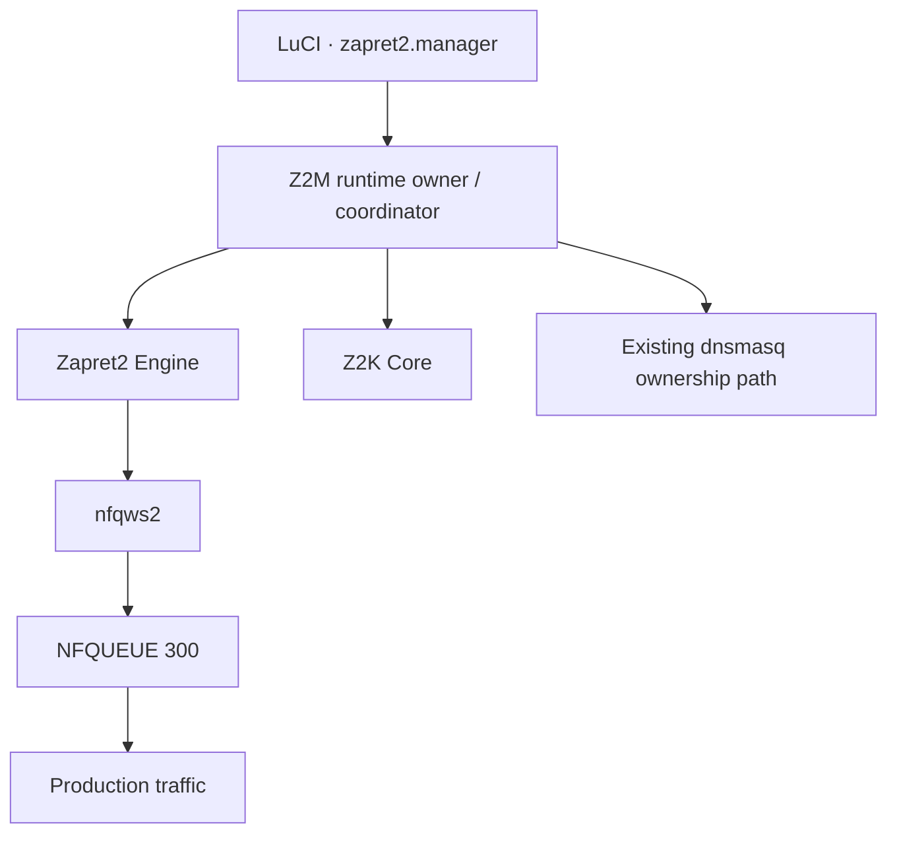

<div align="center">


<br>

[](https://github.com/t0fox/zapret2-manager/actions/workflows/apk-build.yml)
[](https://github.com/t0fox/zapret2-manager/releases/tag/main-latest)
[](https://openwrt.org/)
[](./LICENSE)
[](https://github.com/t0fox/zapret2-manager/commits/main)

**Управляй `zapret2` на OpenWrt через единый LuCI-интерфейс — без ручной сборки разрозненных сценариев вокруг движка.**

[**Скачать `main-latest`**](https://github.com/t0fox/zapret2-manager/releases/tag/main-latest)
&nbsp;·&nbsp;
[**Руководства**](./docs/04-guides/index.md)
&nbsp;·&nbsp;
[**Текущее состояние**](./docs/00-home/current-state.md)
&nbsp;·&nbsp;
[**Issues**](https://github.com/t0fox/zapret2-manager/issues)

</div>

---

## Что такое zapret2.manager

**zapret2.manager (Z2M)** — слой управления `zapret2` для OpenWrt: backend, LuCI-интерфейс и набор согласованных lifecycle-процессов для стратегий, компонентов, DNS, прокси и диагностики.

Главная идея проекта — не просто «запустить `nfqws2`», а дать пользователю **единое место управления** с понятными состояниями, проверками и безопасным применением изменений.

> [!NOTE]
> **Zapret2 Engine** и **Z2K Core** — обязательная системная основа Z2M.
> **Telegram Proxy** и **WARP / MASQUE** — отдельные опциональные продукты и не входят в обязательный runtime manager'а.

## Возможности

| Возможность | Что делает |
|---|---|
| **Стратегии** | Постоянный lifecycle **Preview → Validate → Apply** для изменений обхода |
| **Scanner** | Ищет кандидатов и передаёт результат обратно в Strategy вместо обхода общего lifecycle |
| **Компоненты** | Управляет состоянием **Zapret2 Engine** и **Z2K Core** |
| **Сервисы и домены** | Управляет целями, для которых применяются правила и стратегии |
| **Ресурсы** | Работает с каталогами и low-level assets, используемыми runtime |
| **DNS** | Интегрируется в существующий DNS-path OpenWrt без второго resident DNS daemon |
| **Telegram Proxy** | Отдельный provider lifecycle: установка, переключение, обновление и диагностика |
| **WARP / MASQUE** | Опциональная proxy/routing-поверхность со своей зоной ответственности |
| **Мониторинг и журнал** | Показывает runtime-состояние, события и диагностическую информацию |
| **Резервные копии** | Поддерживает отдельный системный workflow для backup/restore |
| **Настройки** | Централизует системные параметры manager'а |

## Интерфейс

Каноническая навигация Z2M разделена по пользовательским задачам:

```text
Главная

Обход DPI
   ├─ Управление
   ├─ Стратегии
   └─ Scanner

Proxy / Routing
   ├─ WARP / MASQUE
   └─ Telegram Proxy

Списки и данные
   ├─ Сервисы и домены
   ├─ Ресурсы
   └─ DNS

Диагностика
   ├─ Мониторинг
   └─ Журнал

Система
   ├─ Компоненты
   ├─ Резервные копии
   └─ Настройки
```

## Быстрый старт

### 1. Скачай один набор APK

Используй файлы **из одного и того же** GitHub Release:

**[`main-latest` — rolling build текущего `main`](https://github.com/t0fox/zapret2-manager/releases/tag/main-latest)**

> [!IMPORTANT]
> `main-latest` — **prerelease / rolling build**, а не обещание стабильного релиза.
> Перед установкой сверяй `SHA256SUMS` и не смешивай APK из разных сборок.

### 2. Установи пакеты на роутере

```sh
apk add --allow-untrusted \
  ./zapret2-manager-<version>.apk \
  ./luci-app-zapret2-manager-<version>.apk \
  ./zapret2-manager-full-<version>.apk
```

| Пакет | Назначение |
|---|---|
| `zapret2-manager` | Backend: ucode/shell runtime + native `z2m-core-helper` |
| `luci-app-zapret2-manager` | LuCI JavaScript frontend |
| `zapret2-manager-full` | Target-specific meta-package для manager + LuCI |

> [!TIP]
> **Zapret2 Engine** устанавливается отдельно через **Система → Компоненты**.
> **Telegram Proxy** устанавливается отдельно через **Proxy / Routing → Telegram Proxy**.

### 3. Открой LuCI

После установки открой веб-интерфейс OpenWrt и перейди в **zapret2.manager**.

Дальше логичный первый маршрут:

```text
Система → Компоненты
        ↓
проверить Zapret2 Engine + Z2K Core
        ↓
Обход DPI → Стратегии
        ↓
Preview → Validate → Apply
```

## Как это устроено

### Runtime ownership



**Z2M остаётся единственным production runtime owner'ом.** Production traffic обслуживается одним постоянным `nfqws2` на **NFQUEUE 300**, а DNS следует существующему `dnsmasq` ownership path.

### Strategy workflow


Scanner не создаёт второй путь постоянного применения изменений: его результат возвращается в общий Strategy lifecycle.

## Системная модель

| Компонент | Роль | Обязательный |
|---|---|:--:|
| **zapret2.manager** | Production runtime owner / coordinator | Да |
| **Zapret2 Engine** | Базовый anti-DPI engine | Да |
| **Z2K Core** | Интеграционный/runtime foundation manager'а | Да |
| **Avatar Catalog** | Источник стратегий/ресурсов и donor reference | — |
| **Telegram Proxy** | Отдельный optional product | Нет |
| **WARP / MASQUE** | Отдельный optional proxy/routing product | Нет |

> [!WARNING]
> **Avatar** не является системным компонентом Z2M и не должен становиться вторым runtime writer'ом.
> Low-level Z2K assets также не образуют отдельный пользовательский продукт «Z2K Resources».

## Release model

Текущий reproducible release contract закреплён за:

| Параметр | Значение |
|---|---|
| OpenWrt | **25.12.5** |
| Target | **`mediatek/filogic`** |
| Формат пакетов | **APK** |
| Rolling release | **`main-latest`** |
| Проверка | `build-manifest.json` + `SHA256SUMS` |

Сборка должна выпускать ровно три manager-пакета:

```text
zapret2-manager-<version>.apk
luci-app-zapret2-manager-<version>.apk
zapret2-manager-full-<version>.apk
```

Плюс:

```text
build-manifest.json
SHA256SUMS
```

> [!CAUTION]
> Наличие исходников или успешного host-теста само по себе **не доказывает** готовность OpenWrt-пакета, router E2E или публичного релиза.

---

<details>
<summary><strong>Для разработчиков</strong></summary>

<br>

### Сборка

Канонический локальный release entrypoint:

```sh
scripts/release/build-apk.sh
node scripts/release/verify-artifacts.mjs dist
```

Типичная точечная сборка через SDK:

```sh
make package/zapret2-manager/compile V=s
make package/luci-app-zapret2-manager/compile V=s
make package/zapret2-manager-full/compile V=s
```

### Native foundation

`zapret2-manager/src/z2m-core-helper/` содержит native filesystem/helper foundation и protocol manifest.

Ключевые контракты:

- [`native-backend-v1.md`](./docs/04-contracts/native-backend-v1.md)
- [`z2m-canonical-json-v1.md`](./docs/04-contracts/z2m-canonical-json-v1.md)

### Тесты

Для native foundation на Linux:

```sh
scripts/test/native.sh
```

Нужны Node.js, C compiler, `pkg-config`, json-c development files, ucode и passwordless `sudo` для root-policy helper test.

Если ucode установлен не в `/opt/ucode`, укажи:

```sh
export UCODE_BIN=/path/to/ucode
export UCODE_LIBRARY_PATH=/path/to/ucode/libs
```

Host/source tests **не заменяют**:

- реальную сборку OpenWrt SDK;
- router validation;
- browser/runtime evidence.

### Документация

Проект разделяет документацию на три уровня:

| Уровень | Для чего |
|---|---|
| **User docs** | Установка, первый запуск, LuCI navigation, статусы и базовая настройка |
| **DeepWiki** | Архитектура, data flows, RPC/backend contracts и code-centric internals |
| **`docs/` vault** | ADR, contracts, evidence, research, AI/agent operating material и история |

Полезные команды:

```sh
node scripts/docs.mjs verify
node scripts/docs.mjs build public
node scripts/docs.mjs build internal
node scripts/validate-knowledge.mjs
```

### Repository policy

Не коммить:

- APK/IPK и build directories;
- screenshots;
- agent state;
- временные audit/debug outputs;
- одноразовые debugging scripts.

Исторические планы и reports — это evidence, а не источник истины для текущего runtime.
Текущий код, тесты и свежая runtime evidence имеют приоритет.

</details>

## Документация

| Раздел | Ссылка |
|---|---|
| Руководства | [`docs/04-guides`](./docs/04-guides/index.md) |
| Текущее состояние | [`docs/00-home/current-state.md`](./docs/00-home/current-state.md) |
| Архитектура | [`docs/02-architecture`](./docs/02-architecture/) |
| Контракты | [`docs/04-contracts`](./docs/04-contracts/) |
| Research | [`docs/10-research`](./docs/10-research/) |
| Operations | [`docs/11-operations`](./docs/11-operations/) |

## Upstream

- **[`bol-van/zapret2`](https://github.com/bol-van/zapret2)** — anti-DPI engine, вокруг которого строится runtime Z2M.
- **[OpenWrt](https://openwrt.org/)** — целевая router platform.
- **[LuCI](https://github.com/openwrt/luci)** — web UI framework OpenWrt.

## Участие в разработке

Нашёл баг или хочешь предложить улучшение?

- [Создай Issue](https://github.com/t0fox/zapret2-manager/issues)
- Перед изменениями посмотри текущие contracts и architecture notes
- Для runtime-изменений прикладывай проверяемую evidence, а не только host-only результат

## Лицензия

Проект распространяется по лицензии **MIT**. См. [`LICENSE`](./LICENSE).

---

<div align="center">


**zapret2.manager**

<sub>OpenWrt · zapret2 · LuCI</sub>

</div>
