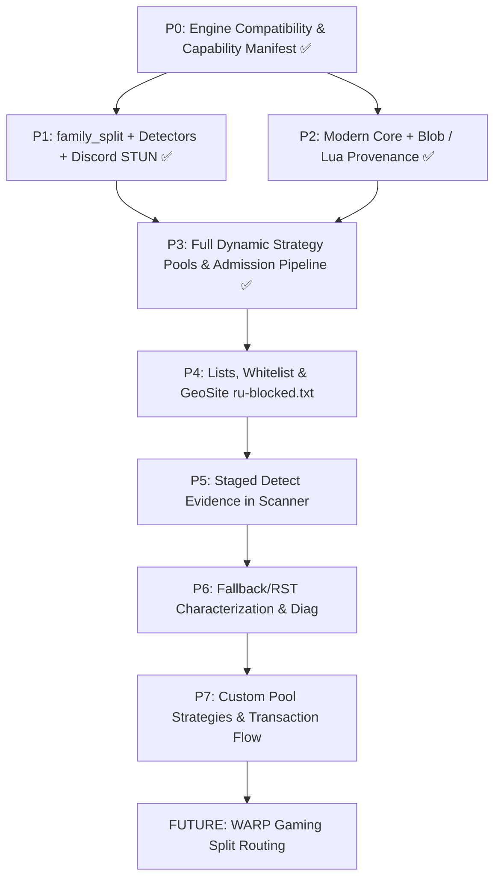

# Z2K OpenWrt-Native Integration Design Specification (Final Revision)

**Status:** Slices P0, P1, P2, P3 Delivered & Verified  
**Upstream Baselines:**
- **`necronicle/z2k`** @ `z2k-enhanced` (`99be613303e00d42ed027d5197f6e353995bb353`, tag `r-77.2`, 2026-08-19)
- **`necronicle/zapret2-z2k`** @ `z2k-master` (`8193742d8fde42fc646fbd10c0d2866572a54d3b`, 2026-08-18)
- **`bol-van/zapret2`** @ `master` (`b08ae78778b602d246596435ea9b3f953f489828`, 2026-08-19)
- **`t0fox/zapret2-manager`** @ `main` (`3c73e90eef8c3499152a950dd617de95a3b6ef58`, 2026-08-19)

---

## 1. Architectural Principles & OpenWrt Boundaries

zapret2-manager operates as an OpenWrt-native, transaction-safe control plane:
1. **Single-Owner / Single-Writer State**: State mutations occur solely via `ucode` / `rpcd` into `/etc/zapret2-manager/` (persisted) and `/tmp/zapret2-manager/` (volatile runtime).
2. **Explicit Dual-Layer Preflight Gating**: Preflight verification requires proving BOTH upstream `NFQWS2_COMPAT_VER` AND explicit patch capabilities (`Z2K_TLS_MOD`, `ANTIDPI_REPEATS_LOOP`, `AUTO_FAMILY_SPLIT`). Patch presence is never blindly inferred from `NFQWS2_COMPAT_VER`.
3. **Machine-Readable Requirements per Strategy**: Every strategy in the catalog declares its required `engineCapabilities`, `luaFunctions`, `blobs`, and `luaFiles`.
4. **4-Stage Admission Pipeline**:
   - `structural parse` $\rightarrow$ `dependency resolution` $\rightarrow$ `native preflight` $\rightarrow$ `isolated smoke/init`.
   - Strategies missing any requirement remain in the catalog as evidence / imported entries with `usable: false` and are never loaded into the active runtime pool.
5. **Fail-Closed Guarantee on Stock Engines**: Running the inventory against stock `bol-van` engine safely gates all Z2K-dependent strategies (`usable: false`) without crashing or executing invalid flags.
6. **Strict Router Resource Budget**: Rigorously benchmarked for resource-constrained OpenWrt routers (128MB–256MB RAM). High-overhead external daemons are avoided in favor of lightweight C helpers and ucode workers.

```mermaid
graph TD
    subgraph Control Plane (ucode / rpcd)
        LuCI[LuCI UI - ES2020 JS] -->|Ubus RPC| RPCD[rpcd ucode Endpoints]
        RPCD --> StateStore[/etc/zapret2-manager/ State & Config]
        RPCD --> Catalog[Strategy Catalog & Corpus]
        Catalog --> Compiler[Strategy Compiler & Requirements Resolver]
        Compiler --> Preflight[Native Preflight & Engine Verification]
        Preflight --> Procd[procd Service Supervisor]
    end

    subgraph Data Plane (Linux Kernel & Engine)
        FW4[OpenWrt fw4 / nftables] --> NFQWS2[nfqws2 Binary + Z2K Patches]
        NFQWS2 --> LuaEngine[Lua 5.1/5.3 Runtime Assets]
        LuaEngine --> StateTSV[state.tsv / Autocircular Storage]
    end
```

---

## 2. Dependency Graph & Validation Hierarchy



---

## 3. Implementation Slices

### Slices Completed & Verified (P0 .. P3)
- **Slice Z2K-P0**: Engine Compatibility & Capability Identity (3-patch series on `bol-van/zapret2`, `native-preflight.json` schema v2, dual-layer preflight, isolated smoke runner `engine-smoke.uc`).
- **Slice Z2K-P1**: `family_split` dual-stack isolation in `zapret-auto.lua`, detector browser-cancel early return fix, QUIC progress detectors (`z2k_quic_success` / `z2k_quic_stall`), runtime assets (`z2k-alert.lua`, `z2k-quic-silence.lua`), and Discord Voice STUN rotator.
- **Slice Z2K-P2**: Modern Core RFC 9001 AEAD preservation (eliminated `live_chance` from `z2k_quic_morph_v2`), profile 3 `ipfrag = ""` fix, and asset provenance validation across 10 runtime Lua assets.
- **Slice Z2K-P3**: Dynamic inventory import from pinned upstream (`tools/z2k-corpus-importer.mjs`), machine-readable requirements modeling, 4-stage admission pipeline (`usable: true/false`), and stock `bol-van` fail-closed verification.

---

### Remaining Slices (Pending Authorization)

---

### Slice Z2K-P4: Lists, Whitelist & GeoSite Integration

#### Goal
Integrate `runetfreedom/russia-blocked-geosite` (`ru-blocked.txt`), RAM safety protection, and canonical whitelist enforcement.

#### Dependencies
- Slice Z2K-P3.

#### Files & Owners
- `zapret2-manager/files/usr/libexec/zapret2-manager/list-fetcher.sh` (or ucode worker): Downloads `ru-blocked.txt` with ETag caching.
- `zapret2-manager/files/usr/libexec/zapret2-manager/service.uc`: Whitelist `--hostlist-exclude=/etc/zapret2-manager/lists/whitelist.txt` enforcement.
- `zapret2-manager/files/usr/libexec/zapret2-manager/strategy-compiler.uc`: Inject list options deterministically.

#### Whitelist & Scope Semantics
- **Host-Addressable Profiles (TCP 443/80, QUIC)**: Whitelist is strictly enforced via `--hostlist-exclude`.
- **Synthetic No-Host Pools (`discord_voice` / STUN)**: Whitelist is explicitly **N/A** (hostname-less UDP traffic cannot be filtered by domain whitelist).

#### Target Router Acceptance
- `ru-blocked.txt` (74k domains) loaded into `nfqws2` without exceeding 28MB RSS.
- Memory protection aborts large list loading if `MemAvailable < 128MB`.

#### Rollback
- Revert to shipped static domain lists.

#### Memory & CPU Budget
- Flash storage: ~1.8MB for `ru-blocked.txt`. `nfqws2` RSS: ~16.7MB.

---

### Slice Z2K-P5: Lightweight Detect Integration & Benchmark Gate

#### Goal
Adapt upstream `z2k-detect` staged prober logic (DNS -> TCP:443 -> TLS -> HTTP cutoff + neutral SNI test) into manager's native C helper / ucode Scanner with empirical benchmark gating.

#### Dependencies
- Slice Z2K-P4.

#### Files & Owners
- `zapret2-manager/src/z2m-core-helper/scanner.c`: Implement staged probing with neutral SNI comparison (`example.com` vs target domain on same IP).
- `zapret2-manager/files/usr/libexec/zapret2-manager/scanner-worker.uc`: Classify `PathSNI`, `PathIP`, `PathServer`, and `FailureCode`.
- `zapret2-manager/files/usr/share/rpcd/ucode/zapret2-manager-domain-hub.uc`: Add confirmed `PathSNI` blocks to auto-discovery list.

#### Resource Budget & Empirical Benchmark Gate
- **Binary Size**: Native helper binary increment <= **150 KB** (vs 6.3MB Go daemon).
- **Startup Time**: Probe startup <= **15 ms** (vs 120ms Go runtime init).
- **Peak RSS during Active Probe**: <= **3.5 MB** RSS on MIPS/ARM.
- **CPU Utilization during Probe**: Peak CPU <= **15%** of a single core.
- **Classification Accuracy**: 100% agreement with upstream `z2k-detect` verdicts on standard blocked test corpus.

#### Rollback
- Disable automated prober worker.

---

### Slice Z2K-P6: Fallback / RST Characterization & Diagnostics Integration

#### Goal
Preserve technical characterization and evidence for RST filtering and Silent Fallback exclusions, and enrich manager status with real-time circular pool health diagnostics.

#### Dependencies
- Slice Z2K-P5.

#### Files & Owners
- `zapret2-manager/docs/05-parity/rst-and-fallback-characterization.md`: Technical report with tcpdump/conntrack evidence.
- `zapret2-manager/files/usr/libexec/zapret2-manager/core/status-observations.uc`: Collect pool rotation counters and drop statistics.
- `zapret2-manager/files/usr/libexec/zapret2-manager/status.uc`: Output schema-3 circular health summary.

#### Target Router Acceptance
- `status.uc` outputs real-time strategy slot, rotation count, and failure rates per pool.
- LuCI Overview renders circular health cards without spawning external tcpdump daemons.

#### Rollback
- Revert status observation extensions.

---

### Slice Z2K-P7: Custom Pool Strategies & Transaction Flow

#### Goal
Implement transactional LuCI workflow for editing custom pool strategies reusing the canonical manager lease owner (`strategy-state.uc` / `strategy-apply-lease.json`).

#### Dependencies
- Slice Z2K-P3, Z2K-P6.

#### Files & Owners
- `zapret2-manager/files/usr/libexec/zapret2-manager/strategy-state.uc`: Manage custom pool overrides using existing lease manager.
- `zapret2-manager/files/usr/libexec/zapret2-manager/strategy-compiler.uc`: Validate candidate strings against full generated nfqws2 config.
- `luci-app-zapret2-manager/files/www/luci-static/resources/view/zapret2-manager/z2m-strategies.js`: Custom strategy modal with dry-run test and apply lease.

#### Transaction Protocol Invariant
- Reuses the existing `strategy-apply-lease.json` (30-second watchdog). Zero new timer authorities introduced.
- Preflight validation must pass before lease initiation.

#### Target Router Acceptance
- Invalid syntax is blocked before touching running service.
- Simulated crash triggers automatic rollback to last-good configuration within 30 seconds.

#### Rollback
- Automatic via lease timeout or manual button.

---

### Slice Z2K-FUTURE: WARP Gaming (Reserved for Milestone M6/M8)

#### Goal
Integrate Cloudflare MASQUE/WARP (`usque`) split routing for gaming CIDRs once unified routing and tunnel infrastructure are established.

#### Dependencies
- Milestone M6 (Unified Routing Architecture) & Milestone M8 (Tunnel Lifecycle Manager).
